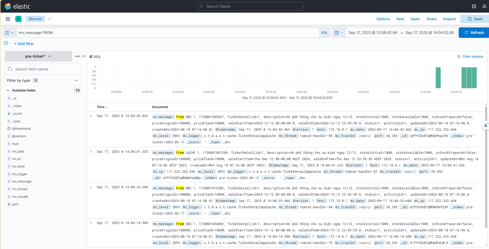
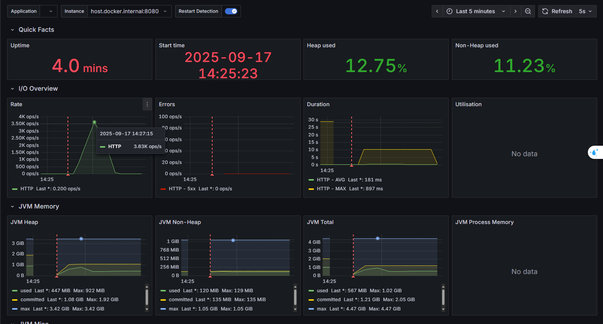

## How to get code:

>> https://drive.google.com/file/u/1/d/1jnXtX3cUCS1ZLloWEatTZzFkDt2qBJAz/view?usp=drive_link&pli=1

## How to run

Open evnvironment -> Run
```bash
docker-compose -f environment/docker-compose-dev.yml up
``` 
```bash
docker-compose -f environment/docker-compose-nginx.yml up
``` 
The above cmd will auto create db with these metrics:
```bash
MYSQL_ROOT_PASSWORD: root1234
MYSQL_DATABSE: ticket
MYSQL_PASSWORD: root1234 
```

Caution:
- When run sucessfully will create a folder `data/db_data` in `environment` \
- if data exist -> please remove before run

### Run 2 server on nginx
Use command clean function in root maven -> command package to build jar file

Server 2233: \
java -jar ticketplatform-start/target/ticketplatform-start-1.0-SNAPSHOT.jar --server.port=2233 \
Server 2244: \
java -jar ticketplatform-start/target/ticketplatform-start-1.0-SNAPSHOT.jar --server.port=2244

### How to test docker service
Redis:
```bash
docker exec -it pre-event-redis redis-cli
```

Mysql:
```bash
docker exec -it pre-event-mysql bash
mysql -uroot -proot1234 ticket
```

### Test high currency using 8 cores with 2000 req/s for eadh thread in 2 minutes
winrk http://localhost:8080/ticket/1/detail/1 -t 8 -c 2000 -d 120



